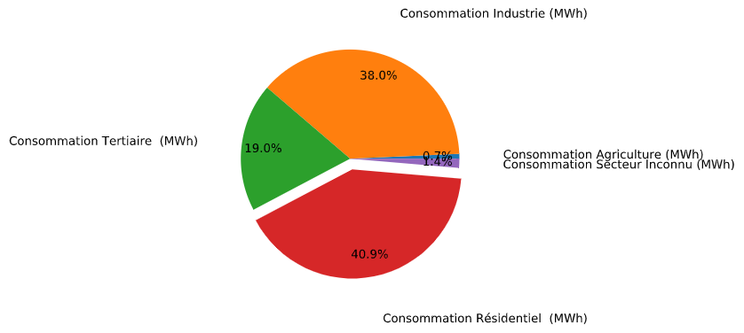
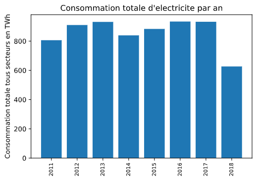
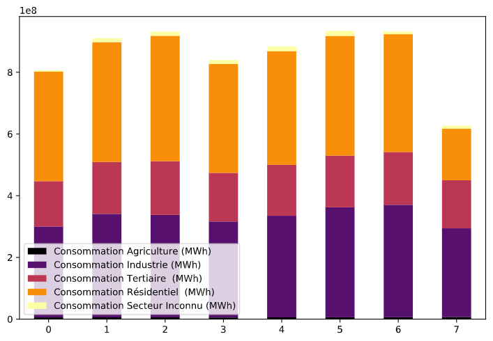
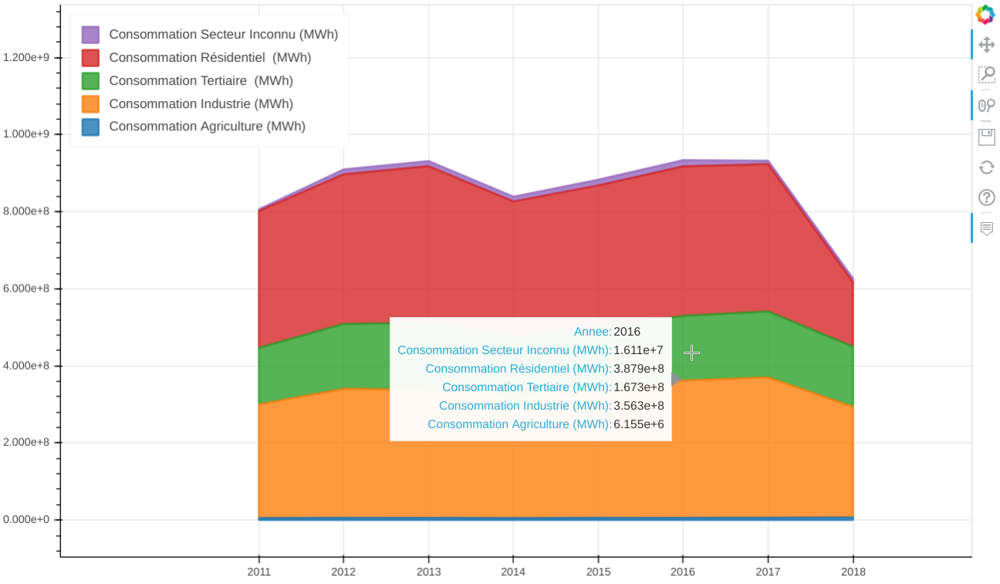

## Consommation d'électricité par secteur d'activité.

### Donnees [Open Data AgenceORE](https://opendata.agenceore.fr/explore/dataset/conso-elec-gaz-annuelle-par-secteur-dactivite-agregee-commune/export/)

Traitement et représentation graphique.

- Création du DataFrame principal
  
  ```python
  import pandas as pd
  
  elec = pd.read_csv('conso-elec.csv', encoding='utf_8', sep=';')
  ```

- Création d'un DataFrame base sur _elec_ ne comportant que la consommation par secteur
  
  ```python
  conso_secteur = elec.filter(like='Consommation', axis=1).astype(int)
  ```
  
  - On calcule les totaux de consommation pour chaque secteur et on extrait les étiquettes ou _labels_
  
  ```python
  secteurs = [nom_colonne for nom_colonne in conso_secteur.columns]
  
  totaux = []
  for colonne in conso_secteur:
      total_secteur = conso_secteur[colonne].sum()
      totaux.append(total_secteur)
  ```

- Les étiquettes prêtes et les totaux calcules, on peut rapidement visualiser la part d'électricité dédiée à chaque secteur d'activité
  
  ```python
  import matplotlib.pyplot as plt
  
  exp = [0, 0, 0, 0.1, 0]
  plt.figure(dpi=110)
  plt.pie(totaux, labels=secteurs, explode=exp, autopct='%1.1f%%', startangle=0, labeldistance=1.4, pctdistance=0.8)
  plt.axis('equal')
  plt.show()
  ```
  
  - On obtient la figure suivante. Elle représente la consommation en MWh de chaque secteur d'activité, de 2011 à 2018



---

### Nous souhaitons à présent voir l'évolution de la consommation par an

- On groupe le _DataFrame_ et on additionne les lignes
  
  ```python
  par_an = elec.groupby('Année').sum()
  par_an.reset_index(inplace=True)
  ```

- Liste des années pour l'axe _x_ du graphique
  
  ```python
  annees = [ligne for ligne in par_an['Année']]
  ```

- Rendre plus lisibles les totaux de consommation énergétique
  
  ```python
  totaux_annee = [total for total in par_an['consototale'].astype(int) / 10**6]
  ```

- On trace notre graphique
  
  ```python
  plt.figure(dpi=150)
  plt.bar(annees, totaux_annee)
  plt.xticks(annees, rotation='90', fontsize=8)
  plt.ylabel('Consommation totale tous secteurs en TWh')
  plt.title('Consommation totale d\'electricite par an')
  plt.show()
  ```
  
  On obtient une figure de la façon suivante



---

### Faisons cela un peu plus intéressant en représentant l'évolution par an _et_ par secteur

- Filtrer les colonnes qui nous intéressent pas (pour le moment)
  
  ```python
  par_an_et_secteur = par_an.filter(like='Consommation', axis=1)
  ```

- Et on trace le graphique
  
  ```python
  par_an_et_secteur.plot(kind='bar', stacked=True, figsize=(15,10), rot=0, colormap='inferno')
  ```
  
  - On obtient



### Une manière plus intéressante de visualiser grâce au _ backend `pandas_bokeh` de la bibliothèque `bokeh`

```python
import pandas_bokeh
pd.set_option('plotting.backend', 'pandas_bokeh')

par_an_et_secteur.plot(kind='area', x=par_an_et_secteur['Annee'], stacked=True, figsize=(1000,600),legend='top_left')
```

Ce _backend_ nous permet de créer des visualisations interactives. L'utilisateur peut voir la valeur spécifique que prend une abscisse en positionnant le curseur dans un endroit du graphique, il peut également zoomer, afficher ou masquer la légende, entre autres.



#### Il serait intéressant par la suite de mener l'interactivité de nos visualisations à un niveau supérieur. Par le biais d'un tableau de bord ou d'une application web par exemple.
