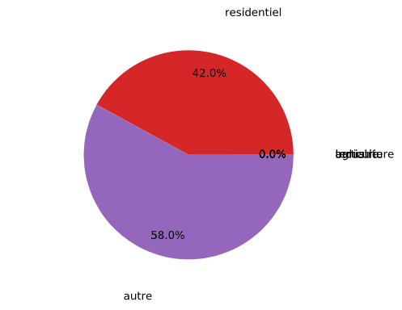

### Etude de la consommation d'électricité par domaine en 2017

Probleme rencontre:

lors de la création d'un _sub dataframe_ qui comprend seulement les colonnes correspondant à la consommation par secteur (Agriculture, Industrie, Tertiaire, Résidentiel, Autres. Respectivement: CONSOA, CONSOI, CONSOT, CONSOR, CONSONA)
on s'aperçoit que nos résultats semblent incohérents par rapport à d'autres analyses (par exemple celle de EDF). En effet:

- En créant le jeu de données:

```python
conso = pd.DataFrame()
conso = elec 2017[['CONSOA', 'CONSOI', 'CONSOT', 'CONSOR', 'CONSONA']]
conso.head(5)
```

- Et en calculant ses totaux respectifs (en MWh)

```python
total_a = conso['CONSOA'].sum()
total_i = conso['CONSOI'].sum()
total_t = conso['CONSOT'].sum()
total_r = conso['CONSOR'].sum()
total_n = conso['CONSONA'].sum()

totaux = [total_a, total_i, total_t, total_r, total_n]
total_ensemble = 0
for total in totaux:
    total_ensemble += total
    
def get_relatifs(liste, T):
    relatifs = []
    for element in liste:
        element = element * 100 / T
        relatifs.append(element)
    return relatifs
```

On obtient le graphique suivant



Le premier réflexe a été de vérifier la méthodologie pour obtenir ces chiffres, mais en vérifiant les montants obtenus, on a:

```python
totaux_dict = dict(zip(domaines, totaux))
totaux_dict
```

Output: 

```
{'agriculture': 3572605,
 'industrie': 1192,
 'tertiaire': 1290562,
 'residentiel': 23718681830,
 'autre': 32716187830}
```

Ce qui correspond bien aux totaux par colonnes.

### Hypotheses:

- Nous avons mal manipule le jeu de données
  
  - TODO: Se renseigner sur la signifcation des variables aupres de la source [Statistiques developement durable]([https://www.statistiques.developpement-durable.gouv.fr/](https://www.statistiques.developpement-durable.gouv.fr/)

- Le jeu de données 2017 possède une anomalie
  
  - TODO: Vérifier auprès d'autres utilisations dans Data Gouv

- Le jeu de données 2017 n'a pas d'anomalies, et nous l'avons bien manipulé. Il représente tout simplement une année en dehors du commun en termes de la quantité d'électricité consommée par secteur d'activité.
  
  - TODO: Dans ce cas là, nous allons créer un DataFrame pour chaque année, en tirer les moyennes, les médianes, les déviations et les totaux individuels et historiques

  
  
